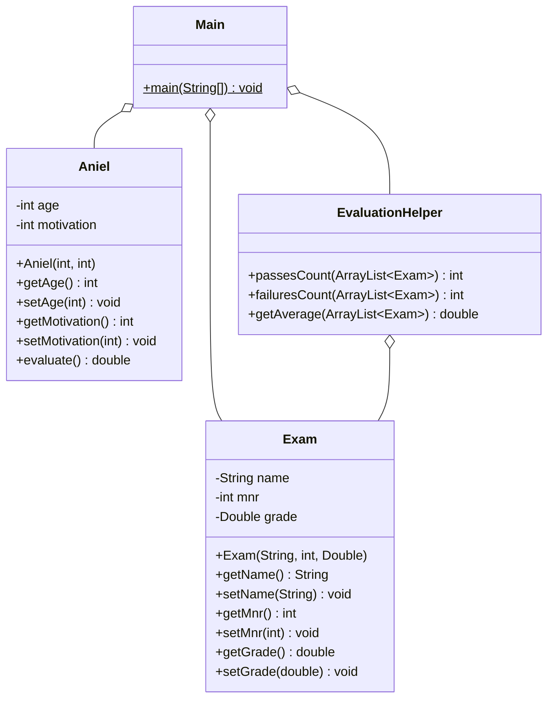

# Aniels Klausurschlamassel

Aniel Dappenmaier muss schon wieder Klausuren seiner DHBW Studenten korrigieren, grrrr.
Kannst du Aniel helfen und ein Programm schreiben, was ihm die Arbeit abnimmt?

Erstelle die Klassen Aniel, EvaluationHelper und Main wie im Klassendiagramm beschrieben um.  
Die Methode evaluate soll ein zufälliges Double zwischen 1.0 und 5.0 zurückgeben.   
Die Methode failuresCount soll die Anzahl der nicht bestandenen Exams zurückgeben.  
Die Methode passesCount soll die Anzahl der bestandenen Exams zurückgeben.   
Die Methode getAverage soll den Durchschnitt der Exams zurückgeben.  

In der Main Methode sollen 5 noch nicht bewertete Exams erstellt werden.    
Anschließend soll Aniel die Exams bewerten.  
Daraufhin soll mit der EvaluationHelper Klasse der failuresCount, der passesCount und der Average der Exams ausgegeben werden  

## Klassendiagramm

