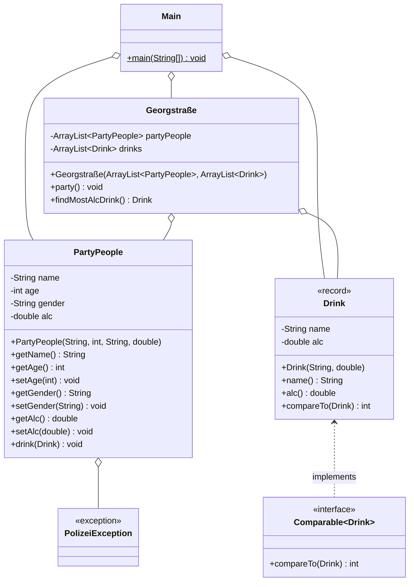

# Hausparty

Diesen Freitag steigt eine tolle Party in der GS11. Wir wollen für den reibungslosen Ablauf ein Programm entwickeln.
Könnt ihr uns helfen?

Erstelle die Klassen Drink, Georgstraße, PartyPeople, PolizeiException und Main wie im Klassendiagramm beschrieben um.  
Die Implementierung von Getter und Setter Methoden kann als gegeben angesehen werden und muss nicht extra gemacht werden.

Die Methode compareTo in Drink soll den Alkoholwert von zwei Drinks vergleichen.

Die Methode drink in PartyPeople soll den Alkoholwert des PartyPeople um den eingehenden Wert des Drinks erhöhen.  
Wenn der resultierende Alkoholwert 3.0 übersteigt, soll: "[name] fängt an zu randalieren" ausgegeben werden und die PolizeiException ausgelöst werden. 

Die Methode party in Georgstraße soll in mehreren Runden (mindestens 3) alle PartyPeople einen zufälligen Drink trinken lassen.  
Falls dabei eine PolizeiException ausgelöst wird, soll diese abgefangen werden und die Party wird beendet.

Die Methode findMostAlcDrink soll von den vorhandenen Drinks mit der compareTo Methode den Drink mit dem höchsten Alkoholwert zurückgeben.

Erstelle in der Main Methode ein paar PartyPeople, ein paar Drinks, lasse die Party steigen und gebe den Drink mit dem höchsten Alkoholwert aus.

Schaffst du es nicht die Party steigen zu lassen, bist du am Freitag herzlich eingeladen. Dann kannst du dir mal anschauen, wie man das macht ;)

## Klassendiagramm

