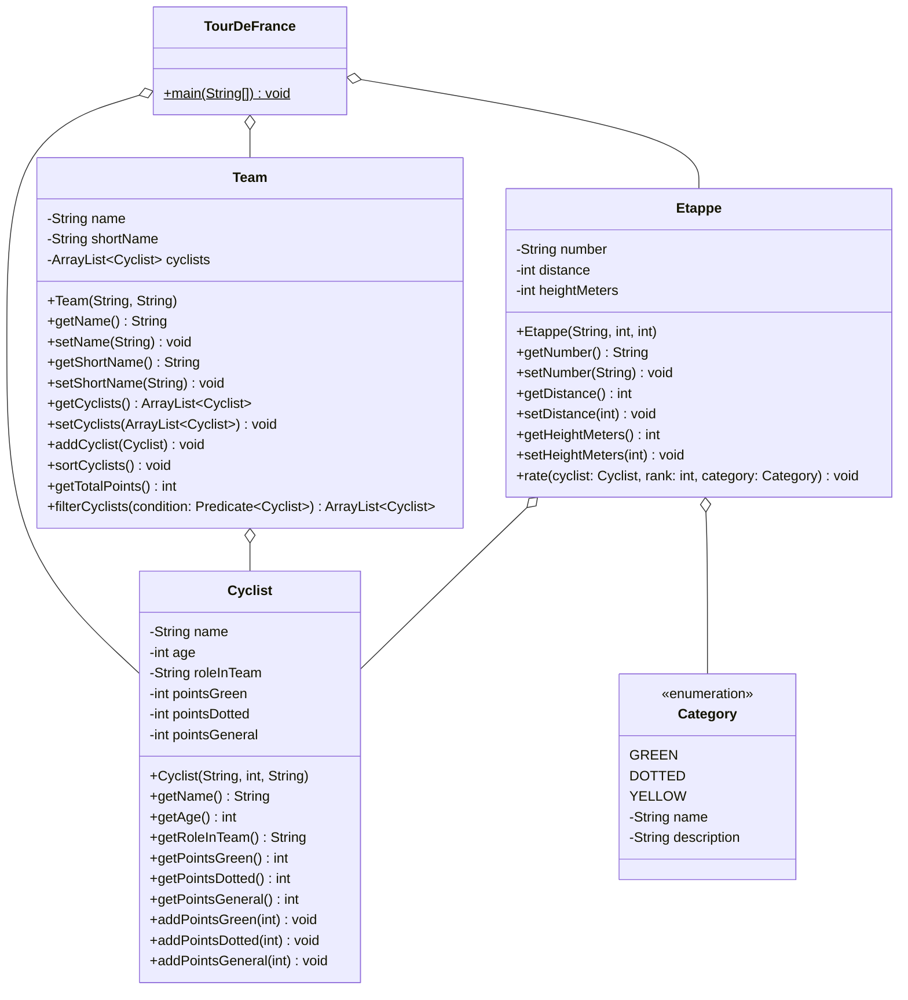

# Tour de France Femmes

Nachdem die Tour de France der Männer von Tadej Pogacar gewonnen wurde, läuft seit dem 1. August die Tour de France.  
Fünf Etappen wurden bereits gefahren und in diesem Moment läuft die sechste Etappe, Zeit das wir uns mal einen Überblick über die aktuelle Rennsituation verschaffen.  
Dafür benötigen die Veranstalter allerdings noch Unterstützung dabei, die führenden Fahrerinnen ausfindig zu machen. Kannst du Ihnen dabei helfen?

Extrapunkte gibt es, wenn du in der Klasse ``TourDeFrance`` bereits die Siegerin der heutigen Etappe einbaust!

Erstelle die Klassen anhand des abgebildeten Klassendiagramms.  

Tipp: Wenn du dir nicht deine Hände wund schreiben willst nutze Lombok um dir Getter und Setter Methoden zu generieren.  
Wenn du dich noch unsicher bei Gettern und Settern fühlst implementiere sie noch manuell.

### Anmerkungen zu den Methoden
In der Klasse ``Cyclist`` soll der Konstruktor die drei Punktewertungen auf 0 setzen.

In der Klasse ``Team`` soll die Methode ``sortCyclists`` die Fahrerinnen absteigend nach den ``pointsGeneral`` sortieren.

In der Klasse ``Team`` soll die Methode ``getTotalPoints`` die ``pointsGeneral`` der Fahrerinnen addieren.

In der Klasse ``Etappe`` soll die Methode ``rate`` der eingehenden Fahrerin Punkte vergeben. Ist ihr ``rank`` dabei kleiner als 25,  
soll sie für die eingehende ``Category`` 25 Punkte minus ihre Platzierung bekommen.  
Wenn der Rank größer gleich 25 ist, sollen sie keine Punkte bekommen.

In der Klasse ``Team`` soll die Methode ``filterCyclists`` eine gefilterte Cyclists-Liste zurückgeben.
Die Filter-Condition soll hierfür als Predicate als Methoden-Parameter übergeben werden können.

Erstelle außerdem eine Main-Methode in der TourDeFrance Klasse in der ein Team mit min. 3 Fahrerinnen erstellt wird  
und auf das anschließend die filterCyclists Methode angewendet wird mit einem Filter deiner Wahl.
Gebe die gefilterte Liste anschließend aus.

## Klassendiagramm

