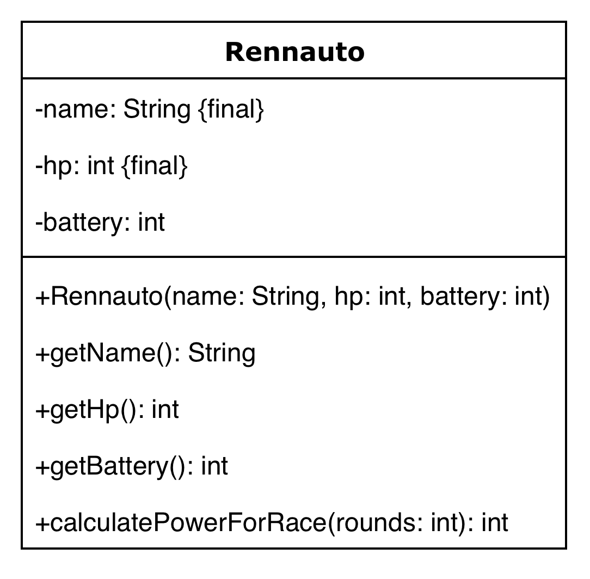

Am 8. März 2026 startet die neue Formel 1 Saison in Australien.  
Mit Beginn der Saison tritt ein neues Motoren-Regelwerk in Kraft.  

Die Teams sind nervös und möchten wissen, wie ihre Performance im ersten Rennen voraussichtlich aussehen wird.

Der Team Principal von McLaren hat dich beauftragt, eine Simulation des Rennen zu programmieren.  
Ziel ist es, zu analysieren, wie sich McLaren gegen seine stärksten Konkurrenten (Red Bull, Ferrari, Mercedes) der letzten Jahre schlägt.


Erstelle hierfür folgende Klasse:



In der Methode calculatePowerForRace soll die gesamte Motor-Power für ein Rennen berechnet werden.  
Die Berechnung erfolgt nach folgenden Regeln:

1. Für jede Runde wird die HP zur Gesamtleistung addiert
2. Für jede Runde wird die aktuelle Battery zu Gesamtleistung addiert                                       
3. Nach jeder Runde wird die Battery um 1 reduziert, solange sie noch größer als 0 ist
4. Die Methode gibt am Ende die Gesamtleistung zurück

Erstelle eine Main Klasse.  
In der main-Methode sollen folgende Rennautos initialisiert werden:  
1. McLaren, HP = 405, Battery = 85
2. Ferrari, HP = 415, Battery = 70
3. RedBull, HP = 410, Battery = 75
4. Mercedes, HP = 395, Battery = 95

Der Australien Grand Prix hat 58 Runden. Lasse alle vier Autos das Rennen fahren.  
Berechne die Gesamtleistung jedes Autos und gib anschließend den Gewinner in folgender Form aus:

```McLaren wins with 26767 power.```