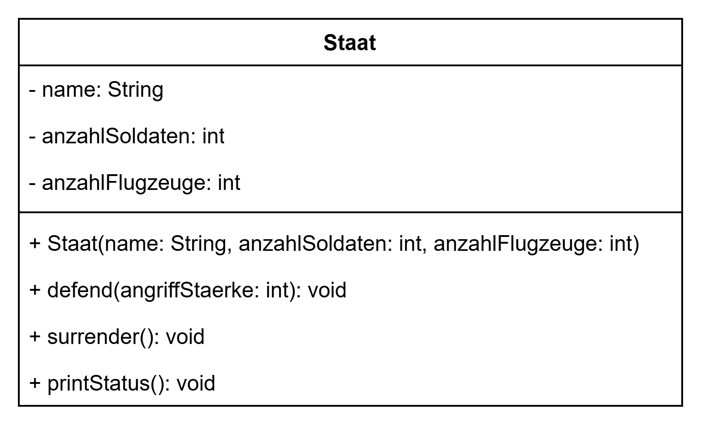
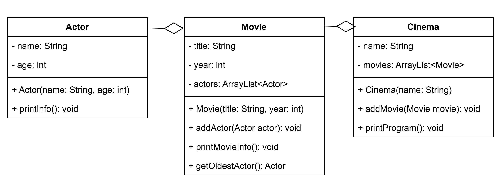

# Tutorium 02.03. – Weitergeführte Objektorientierte Programmierung

---

## Aufgabe 1 – Formularerstellung

Microsoft möchte seine Forms-Anwendung programmieren. 

**a)** Implementiere die Klasse von der Tafel. 
* Die Methode `toString()` soll alle Attribute als einen String zurückgeben.


**b)** Erstelle die `Main`-Klasse mit `main`-Methode. Erstelle drei Formular-Instanzen und gebe sie aus.


## Aufgabe 2 – Militärsimulation

Am Wochenende ist ein weiterer globaler Konflikt ausgebrochen. Die UN möchte abschätzen, wie eine komplette Eskalation ausgehen würde. Unterstütze die UN mit einem Programm.

Gegeben ist folgendes Klassendiagramm:



**Allgemeine Hinweise**
* Aus Gründen der Übersicht werden im Klassendiagramm keine Getter und Object-Methoden dargestellt
* So nicht anders angegeben, sollen Konstruktoren, Setter, Getter sowie die Object-Methoden wie gewohnt implementiert werden


**a)** Implementiere die Klasse Staat.
* Die Methode `defend(angriffStaerke: int)` soll die eingegebene Zahl von der `anzahlSoldaten` abziehen. Ein Staat darf nicht weniger als 0 Soldaten haben. 
* Die Methode ``surrender()`` soll die `anzahlSoldaten` und die `anzahlFlugzeuge` auf 0 setzen.
* Die Methode `printStatus()` soll alle Attribute ausgeben.

**b)** Implementiere eine ``Main``-Klasse mit ``main``-Methode. 
* Erstelle die Länder `Israel`, `Iran` und `USA` und weise ihnen Soldaten und Flugzeuge hinzu. 
* Lass die Länder abwechselnd verteidigen und gib zwischendurch die Stärke der Länder mit `toString()` aus.

## Aufgabe 3 – Kinoverwaltunng

Das Kino möchte zu Filmabenden einladen und braucht ein System zur Verwaltung ihrer Vorführungen.

Gegeben ist folgendes Klassendiagramm:



**Allgemeine Hinweise**
* Aus Gründen der Übersicht werden im Klassendiagramm keine Getter und Object-Methoden dargestellt
* So nicht anders angegeben, sollen Konstruktoren, Setter, Getter sowie die Object-Methoden wie gewohnt implementiert werden


**a)** Implementiere die Klasse ``Movie``.  
Der Konstruktor soll jeweils alle Attribute initialisieren. ``printMovieInfo()`` soll eine Ausgabe der folgenden Art erzeugen:
```
Titel: Roman Holiday (1953)
Schauspieler:
- Gregory Peck (39)
- Audrey Hepburn (24)
```

Die Methode ``getOldestActor()`` soll den ältesten ``Actor`` der Liste ausgeben.

**b)** Implementiere die Klasse ``Cinema``.  
Der Konstruktor soll jeweils alle Attribute initialisieren. ``printProgram()`` soll den Kinonamen und alle Filme mit ihren Infos ausgeben.

**c)** `Erstelle in der ``main``-Methode ein ``Cinema``-Objekt. Lege zwei Filme an, füge jeweils zwei Schauspieler hinzu und rufe ``printProgram()`` auf. Gib außerdem für jeden Film den ältesten Schauspieler aus.
