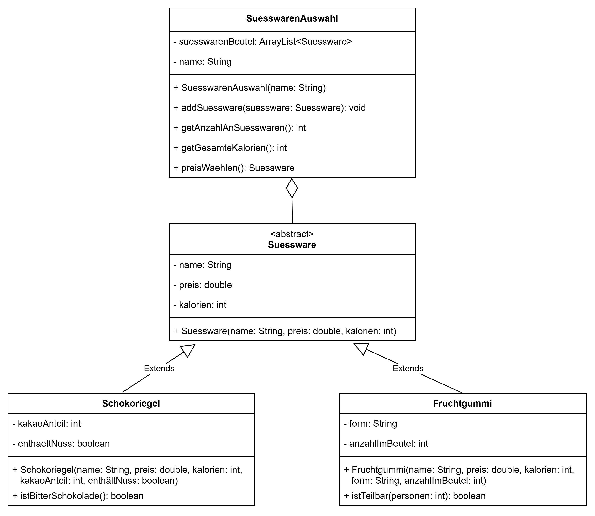

# Tutorium 06.03. – Vererbungen

---
## Aufgabe 1 – Kahoot-Preise

Das Tutorium startet immer mit einem Kahoot. Joa und Jonas haben viel diskutiert, was für dich ein würdiger Preis ist, wenn du das Kahoot gewinnst. Kannst du ihnen ein Programm schreiben, was sie bei der Auswahl unterstützt?

Gegeben ist folgendes Klassendiagramm:

**Allgemeine Hinweise**
* Aus Gründen der Übersicht werden im Klassendiagramm keine Getter und Object-Methoden dargestellt
* So nicht anders angegeben, sollen Konstruktoren, Setter, Getter sowie die Object-Methoden wie gewohnt implementiert werden
* Wenn du dich mit den Gettern und Settern sicher fühlst, reicht es, wenn du sie für eine Klasse implementierst. Denke aber in der Klausur unbedingt daran!

**Hinweise zur Klasse SuesswarenAuswahl**
* Die Methode `addSuessware(suessware: Suessware)` soll die eingegebene Süßware dem Süßwaren-Beutel hinzufügen.
* Die Methode `getGesamteKalorien()` soll die Summe aller Kalorien aus dem Süßwaren-Beutel zurückgeben.
* Die Methode `preisWaehlen()` soll zufällig eine Süßware aus dem Beutel wählen, zurückgeben und aus dem Süßwaren-Beutel entfernen.

**Hinweise zur Klasse Schokoriegel**
* Die Variable `kakaoAnteil` gibt den Kakao-Anteil in % an.
* Die Methode `istBitterSchokolade()` soll `true` zurückgeben, wenn der Kakao-Anteil mindestens 60% beträgt.

**Hinweise zur Klasse Fruchtgummi**
* Die Methode `istTeilbar(personen:int)` soll überprüfen, ob die Anzahl im Beutel durch die Anzahl der Personen teilbar ist.

**a)** Implementiere alle Klassen aus dem Klassendiagramm.

**b)** Implementiere eine ausführbare Klasse, die einer SuesswarenAuswahl ein Snickers, ein Mars und ein Fruchtgummi hinzufügt. 
  Tizian hat schon viel für die Klausur geübt und das Kahoot gewonnen. Führe die Methode ``preisWaehlen()`` aus. Falls er ein Fruchtgummi gewonnen hat, möchte er das gerne mit seinem Freund Krüger teilen. Überprüfe, ob die beiden das Fruchtgummi fair unter sich aufteilen können.
