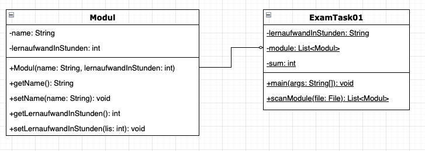

# Prozedurale Programmierung - Klausuraufgabe (20 Punkte)

Erstelle die ausführbare Klasse ExamTask01 wie folgt:

* Zu Beginn soll der Student seinen Lernaufwand in Stunden eingeben
* Das Programm soll die Methode scanModule(File file) nutzen um Module von einer Datei einzuscannen
* Das Programm soll den Lernaufwand für die Module zusammenrechnen
* Das Programm soll ausgeben ob der Student genug lernt oder noch mehr lernen muss

### Klassendiagramm



### Beispielhafter Aufbau der Moduledatei
```
Logik und Algebra;90
Programmieren 1;100
Bodo;2
```

### Tipp: Das File-Objekt wird so erstellt:
```
File file = new File("module.txt");
```

### Beispielhafte Konsolenausgabe
```
Lernaufwand in Stunden eingeben:100
Du musst mehr lernen!
```