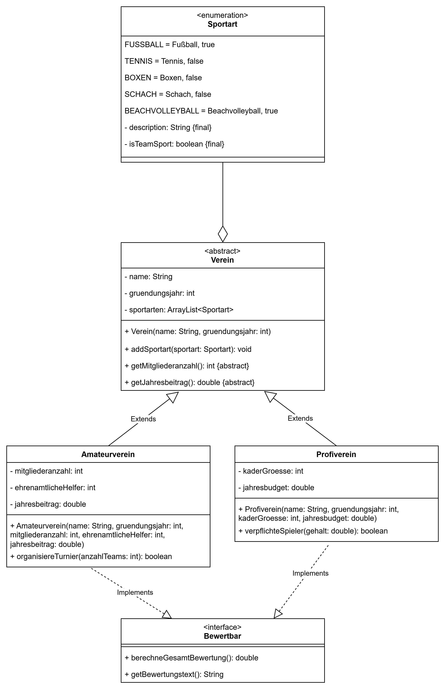

# Tutorium 10.03. – Klausurvorbereitung

---

## Aufgabe 2 - Sportvereine

Gegeben ist folgendes Klassendiagramm:

**Allgemeine Hinweise**
* Aus Gründen der Übersicht werden im Klassendiagramm keine Getter und Object-Methoden dargestellt
* So nicht anders angegeben, sollen Konstruktoren, Setter, Getter sowie die Object-Methoden wie gewohnt implementiert werden

**Hinweise zur Klasse Verein**
* Die Methode `addSportart(sportart: Sportart)` soll eine Sportart der Liste sportarten hinzufügen.

**Hinweise zur Klasse Profiverein**
* Die Methode `getMitgliederanzahl()` soll die Kadergröße zurückgeben.
* Die Methode `getJahresbeitrag()` soll das Jahresbudget zurückgeben.
* Die Methode `verpflichteSpieler(gehalt: double)` soll `true` zurückgeben, wenn das Gehalt kleiner ist als das durchschnittliche Jahresbudget pro Spieler.
* Die Methode `berechneGesamtBewertung()` soll das durchschnittliche Budget pro Spieler zurückgeben.
* Die Methode `getBewertungstext()` soll bei einem Budget pro Spieler über 100.000€ `Bundesliga-Niveau` zurückgeben, andernfalls `Kreisliga-Niveau`.

**Hinweise zur Klasse Amateurverein**
* Die Methode `organisiereTurnier(anzahlTeams:int)` soll `true` zurückgeben, wenn es mindestens so viele ehrenamtliche Helfer gibt wie Teams.
* Die Methode `berechneGesamtBewertung()` soll den Anteil der Mitglieder angeben, die sich ehrenamtlich engagieren.
* Die Methode `getBewertungstext()` soll bei einem Prozentsatz an Ehrenamtlichen über 30% `Gold` zurückgeben, andernfalls `Bronze`.

**a)** Implementiere die Klassen ``Sportart``, ``Profiverein`` und ``Bewertbar`` aus dem Klassendiagramm.

**b)** Implementiere eine ausführbare Klasse, die einen Schachverein im Amateurbereich erstellt. Führe ein paar Methoden aus.