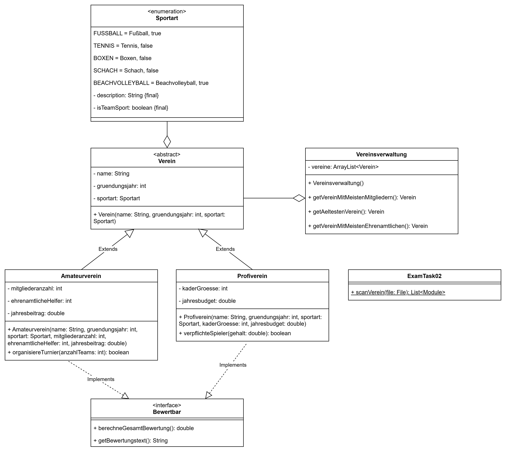

# Tutorium 13.03. – Klausurvorbereitung

---

## Aufgabe 2 - Sportvereine


Gegeben ist folgendes Klassendiagramm:




**Allgemeine Hinweise**
* Aus Gründen der Übersicht werden im Klassendiagramm keine Getter und Object-Methoden dargestellt
* So nicht anders angegeben, sollen Konstruktoren, Setter, Getter sowie die Object-Methoden wie gewohnt implementiert werden

**Hinweise zur Klasse X**
* Die Methode `addSportart(sportart: Sportart)` soll eine Sportart der Liste sportarten hinzufügen.

**Hinweise zur Klasse Profiverein**
* Die Methode `verpflichteSpieler(gehalt: double)` soll `true` zurückgeben, wenn das Gehalt kleiner ist als das durchschnittliche Jahresbudget pro Spieler.
* Die Methode `berechneGesamtBewertung()` soll das durchschnittliche Budget pro Spieler zurückgeben.
* Die Methode `getBewertungstext()` soll bei einem Budget pro Spieler über 100.000€ `Bundesliga-Niveau` zurückgeben, andernfalls `Kreisliga-Niveau`.

**Hinweise zur Klasse Amateurverein**
* Die Methode `organisiereTurnier(anzahlTeams:int)` soll `true` zurückgeben, wenn es mindestens so viele ehrenamtliche Helfer gibt wie Teams.
* Die Methode `berechneGesamtBewertung()` soll den Anteil der Mitglieder in % zurückgeben, die sich ehrenamtlich engagieren.
* Die Methode `getBewertungstext()` soll bei einem Prozentsatz an Ehrenamtlichen über 30% `Gold` zurückgeben, andernfalls `Bronze`.

**Hinweise zur Klasse Vereinsverwaltung**
* Die Methode `getVereinMitMeistenMitgliedern()` soll den Verein mit den meisten Mitgliedern zurückgeben.
* Die Methode `getAeltestenVerein()` soll den ältesten Verein zurückgeben.
* Die Methode `getVereinMitMeistenEhrenamtlichen()` soll den Verein zurückgeben, der den größten Anteil an Ehrenamtlichen hat.

**a)** Implementiere die Klassen ``Sportart``, ``Profiverein``, ``Bewertbar`` und `Vereinsverwaltung` aus dem Klassendiagramm.

**b)** Implementiere die Klasse ``ExamTask02`` mit der Methode `scanVerein(file: File)`, die aus der Datei Amateurvereine erstellt.

**Beispielhafter Aufbau der Vereinsdatei:**
```
TSB Ravensburg;1847;Fußball;3700;35;80
TC Ravensburg;1892;Tennis;500;47;210
Lübecker Schachverein;1873;Schach;230;14;60
```