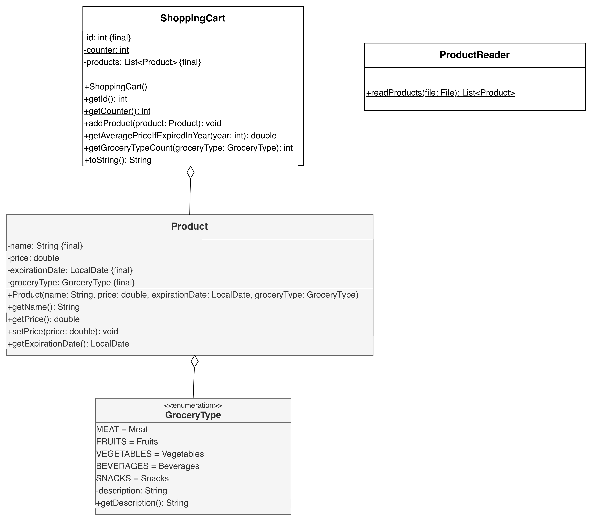

# Aufgabe 1: Objektorientierter Programmentwurf 33,5 Punkte
Erstelle die Klassen ShoppingCart (21 Punkte) und ProductReader (12,5 Punkte) anhand des abgebildeten Klassendiagramms.

# Klassendiagramm


# Hinweise zur Klasse ShoppingCart
* Der Konstruktor soll den Zähler inkrementieren, die Produktliste initialisieren sowie der ID den Wert des Zählers zuweisen
* Die Methode ```void addProduct(product: Product)```(1,5 Punkte) soll der Produktliste das eingehende Produkt hinzufügen
* Die Methode ```String toString()``` (1,5 Punkte) soll die ID sowie die Produktliste als String zurückgeben.
* Die Methode ```double getAveragePriceIfExpiredInYear(year: int)``` (7,5 Punkte) soll den durchschnittlichen Preis aller Produkte, die im eingehenden Jahr ablaufen, zurückgeben
* Die Methode ```int getGroceryTypeCount(groceryType: GroceryType)``` (4,5 Punkte) soll die Anzahl der Produkte in der Produktliste zurückgeben, die dem eingehenden GroceryType entsprechen

# Hinweise zur Klasse ProductReader
* Die statische Methode ```List<Product> readProducts(file: File)``` (12 Punkte) soll alle Produkte der eingehenden Datei zurückgeben

# Beispielhafter Aufbau der Produktdatei
```
Magerquark;0.99;2026;4;24;SNACKS
Äpfel;2.49;2026;3;29;FRUITS
Dosen Mais;1.39;2028;7;14;VEGETABLES
Grissotti;1.29;2027;1;19;SNACKS
```